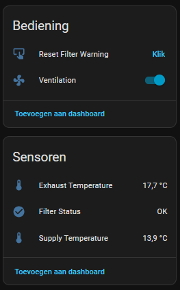

[](https://github.com/hacs/integration)

[](https://github.com/jarcovlieger/brink-hrv-modbus/releases) 

# Brink HRV Modbus Integration
Home Assistant integration to connect your Brink HRV (Heat Recovery Ventilation) to Home Assistant via Modbus TCP.



## Installation
To install the Brink HRV Modbus Integration, follow these steps:

#### HACS installation
[](https://my.home-assistant.io/redirect/hacs_repository/?owner=jarcovlieger&repository=brink-hrv-modbus=integration)

1. Go to the [HACS](https://hacs.xyz) panel
2. Go to integrations 
3. Search for 'Brink HRV Modbus'
4. Click \'Download this repository with HACS'.

#### Manual installation
1. Copy the ```brink_hrv_modbus``` folder into your ```custom_components``` folder

## Setup
1. Navigate to <b>Settings -> Devices & Services</b>
2. Click on <b>+ Add Integration</b>
3. Search for <b>"Brink HRV Modbus"</b>
4. Add in the <b>IP</b> of your modbus gateway and <b>port</b>

## Documentation
[modbus-uwa2-b-uwa2-e-installation-regulations-614882.pdf](https://www.brinkclimatesystems.nl/documenten/modbus-uwa2-b-uwa2-e-installation-regulations-614882.pdf)

## Tested devices
- Brink Flair 300
